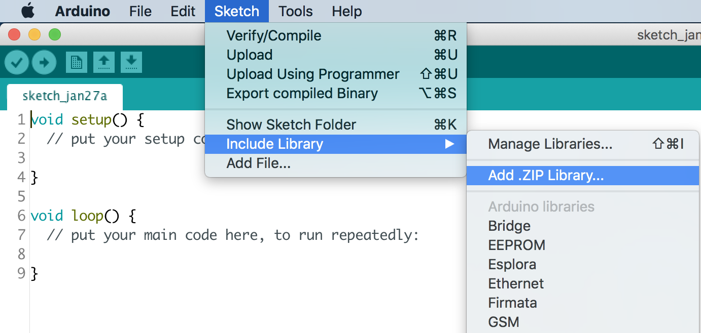
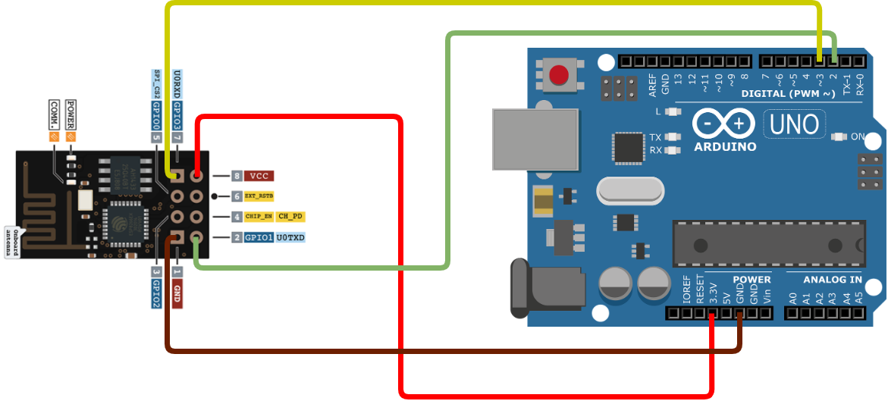
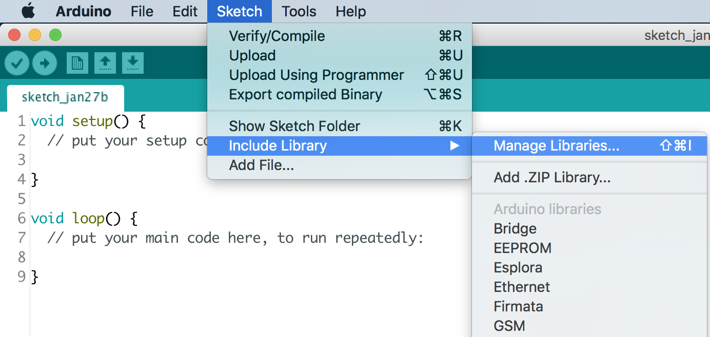
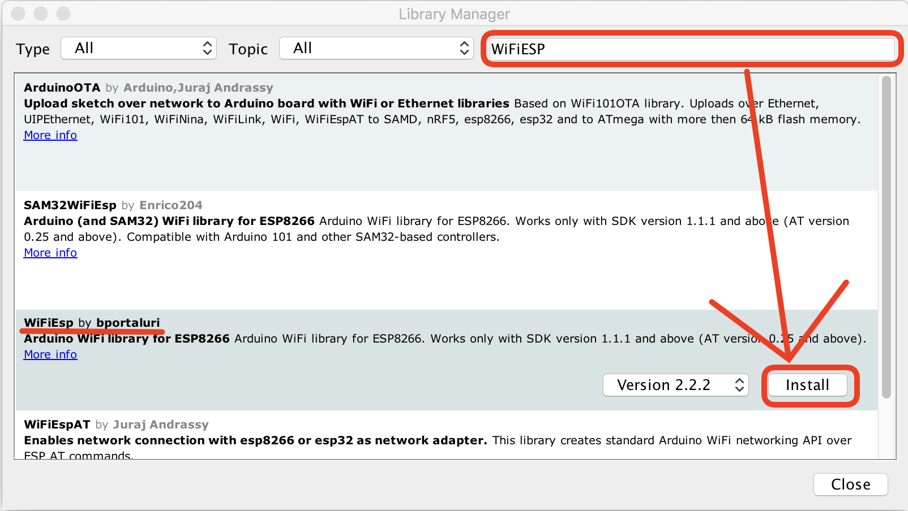
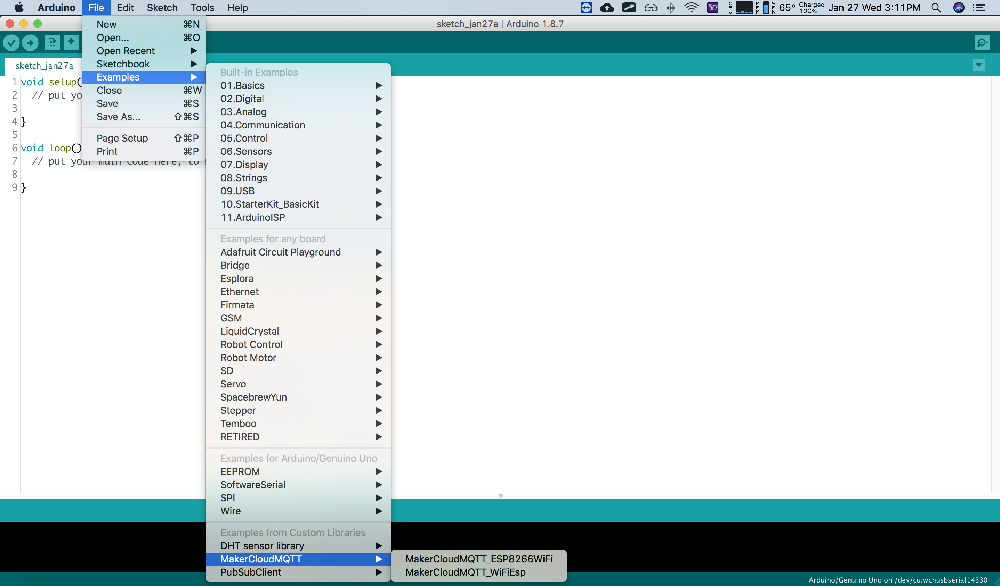

# 使用Arduino連接創客雲
Arduino是現在最受歡迎的微控制板之一，能配合使用各種不同類型的傳感器、馬達等。  
而為了迎合科技的發展，Arduino推出了可連接Wi-Fi的型號。同時，亦有不少Wi-Fi模組推出，令Arduino可以連接Wi-Fi。  
因此，Arduino可以利用Wi-Fi和不同的配件創造物聯網專題。

[TOC]

## 創客雲 Arduino MakerCloudMQTT
雖然Arduino有支援MQTT的Library，但普遍使用上均有一定的難道。為了方便使用者連接創客雲，我們編寫了MakerCloudMQTT Library。

首先，下載創客雲 Arduino Library:  
[MakerCloudMQTT Library](library/MakerCloudMQTT.zip)

#### 安裝方法
在使用MakerCloudMQTT之前必須**預先安裝**:  
Arduino IDE

##### 安裝Arduino IDE
使用者可到Arduino官方網站下載安裝程式: [下載Arduino IDE](https://www.arduino.cc/en/software)  
下載後，開啟安裝程式並按指示完成安裝。

## 導入MakerCloudMQTT
1. **新増專案**  
   File -> New
2. **導入MakerCloudMQTT**  
   Sketch -> Include Libray -> Add .ZIP Library


## 連接創客雲
不同的Arduino版本和Wi-Fi配件會有不同連接Wi-Fi的編程和方法。  
以下的教學會以Arduino配合ESP-01(ESP8266模組)作示範。

### Arduino ESP-01連接Wi-Fi
#### 連接方法



* ESP01 ------------> Arduino
* VCC --------------> 3.3v
* GND -------------> GND
* TX ----------------> P2
* RX ----------------> P3

把線路連接後，需要先利用以下AT指令設定ESP01的**Baud Rate為9600bps**：
```
AT+UART_DEF=9600,8,1,0,0
```

#### 安裝WiFiESP Library
EPS-01需要使用WiFiESP Library來連接WiFi。

1. Sketch -> Include Library -> Manage Libraries

<br><br>
2. 搜尋並安裝「WiFiESP」


#### 連接編程示範
```cpp
#include <SoftwareSerial.h>
#include <WiFiEsp.h>
#include <MakerCloudMQTT.h>

// Change the credentials below, so your ESP8266 connects to your router
const char* ssid = "ssid";
const char* password = "password";


// Setting ESP8266 Serial Port(TX-P2, RX-P3)
SoftwareSerial ESP8266(2, 3);

// Initializes the espClient.
WiFiEspClient espClient;
MakerCloudMQTT MakerCloudClient(espClient);

// WiFi Status
int WiFi_Status = WL_IDLE_STATUS;

// This functions connects your ESP8266 to your router
void setup_wifi() {
  //Setting ESP8266 Baud Rate(9600bps)
  ESP8266.begin(9600);

  //Init ESP8266
  WiFi.init(&ESP8266);

  Serial.print("Processing WiFi Setting!\r\n");
  do {
    Serial.println("WiFi Connecting ...");
    WiFi_Status = WiFi.begin(ssid, password);
    delay(500);
  } while (WiFi_Status != WL_CONNECTED);

  Serial.println("ＷiFi Connected!");
  Serial.print("IP Address: ");
  Serial.println(WiFi.localIP());
  Serial.print("SSID: ");
  Serial.println(WiFi.SSID());
  Serial.println("WiFi Setting Done");
}

void setup() {
  Serial.begin(115200);

  // MakerCloudMQTT Configuration
  MakerCloudClient.setUsername("Max");
  // Enable to print extra log
  MakerCloudClient.setLog(true);

  // Connect ESP8266 to router
  setup_wifi();

  // Connect to MakerCloud
  MakerCloudClient.connect();
}
```

### 通用的連接方法
除了上述的Wi-Fi Library，MakerCloud亦支援其他不同的Wi-Fi Library。

#### 連接編程示範
```cpp
EthernetClient ethClient;
MakerCloudMQTT MakerCloudClient(ethClient);

// This function connects Wi-Fi
void setup_wifi() {

}

void setup() {
  Serial.begin(115200);

  // MakerCloudMQTT Configuration
  MakerCloudClient.setUsername("Max");
  // Enable to print extra log
  MakerCloudClient.setLog(true);
  
  // Connect Wi-Fi
  setup_wifi();

  // Connect to MakerCloud
  MakerCloudClient.connect();
}
```

## MakerCloudMQTT範例
在「Examples from Custom Libraries」中，有ESP8266WiFi和WiFiEsp Library所編寫的範例。  
範例中包含了連接、發布和訂閱的編程示範。

