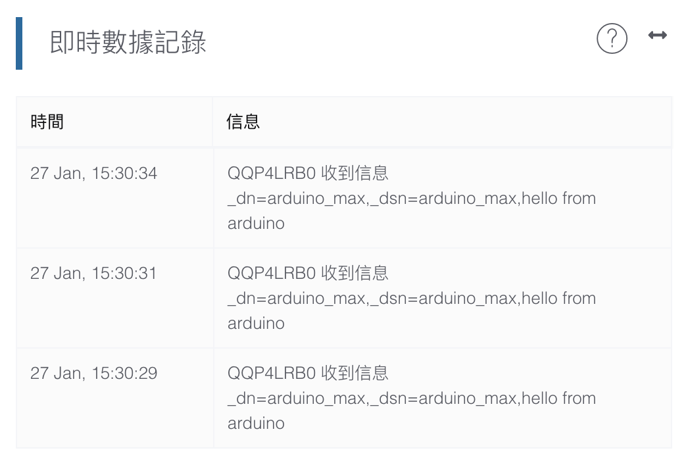
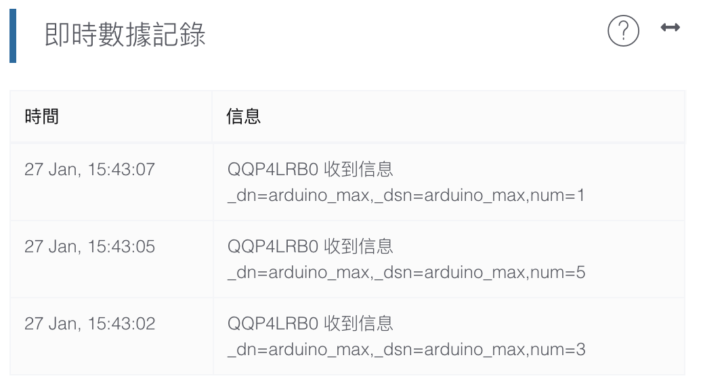

# 使用Arduino發布訊息
在編程發布訊息到創客雲前，使用者必先學習如何令Arduino連接創客雲MQTT，連接方法可參考上面的教學。  
[使用Arduino連接創客雲](../../ch4_connect/arduino/connect_arduino.md)

[TOC]

## 發布訊息
以下的示範將會使用通用的連接方法。

#### MakerCloudClient.publish_message()
向創客雲發布一個文字訊息到主題
```cpp
MakerCloudClient.publish_message(topic, message)
```
**topic**  
在「創客雲」上創建的主題名稱

**message**  
需要發佈的文字訊息

#### MakerCloudClient.publish_key_message()
向創客雲發布一個鍵文字對訊息到主題
```cpp
MakerCloudClient.publish_key_message(topic, key, message)
```
**topic**  
在「創客雲」上創建的主題名稱

**key**  
需要發佈的鍵

**message**  
需要發佈的文字訊息

#### MakerCloudClient.publish_key_value()
向創客雲發布一個鍵值對訊息到主題，創客雲上會自動建立對應的直線圖表
```cpp
MakerCloudClient.publish_key_value(topic, key, value)
```
**topic**  
在「創客雲」上創建的主題名稱

**key**  
需要發佈的鍵

**value**  
需要發佈的數值

#### MakerCloudClient.publish_coordination()
向創客雲發布一個鍵值對訊息到主題，創客雲上會自動建立對應的直線圖表
```cpp
MakerCloudClient.publish_coordination(topic, latitude, longitude)
```
**topic**  
在「創客雲」上創建的主題名稱

**latitude**  
需要發佈的緯度

**longitude**  
需要發佈的經度

使用者可以根據數據類型使用相對應的發布函數。

## 發布文字訊息
#### 學習重點
- 學習如何利用Arduino發布文字訊息到創客雲主題中

#### 練習
讀取輸入文字，然後發布到創客雲主題中。

**在Arduino編程前，我們需要在創客雲上:**

1. 創建項目
2. 創建主題
3. 在創客雲複製主題名稱  
{:width="80%"}

**然後便可到Arduino IDE編程:**
```cpp
EthernetClient ethClient;
MakerCloudMQTT MakerCloudClient(ethClient);

// This function connects Wi-Fi
void setup_wifi() {

}

void setup() {
  Serial.begin(115200);

  // MakerCloudMQTT Configuration
  MakerCloudClient.setUsername("Max");
  // Enable to print extra log
  MakerCloudClient.setLog(true);
  
  // Connect Wi-Fi
  setup_wifi();

  // Connect to MakerCloud
  MakerCloudClient.connect();
}

// The looping function will allow sending message to MakerCloud
void loop() {
  // Publish message
  MakerCloudClient.publish_message(topic, "hello from arduino");
  delay(2000);
}
```

上載編程後，回到創客雲的項目主頁。  
在即時數據紀錄視窗中便可看到從Arduino發布的文字訊息。  
{:width="70%"}

### 發布鍵值對訊息
#### 學習重點
- 學習如何透過Arduino發布鍵值對到創客雲主題中
- 學習在創客雲上創建直線圖表達鍵值對訊息

#### 練習 - 發布隨機數字
##### 目標
- 發布鍵值對訊息(隨機數字)到創客雲
- 在創客雲上創建直線圖以顯示鍵值對

**在Arduino編程前，我們需要在創客雲上:**

1. 創建項目
2. 創建主題
3. 在創客雲複製主題名稱  
{:width="80%"}

**然後便可到Arduino IDE編程:**
```cpp
EthernetClient ethClient;
MakerCloudMQTT MakerCloudClient(ethClient);

// This function connects Wi-Fi
void setup_wifi() {

}

void setup() {
  Serial.begin(115200);
  randomSeed(analogRead(0));

  // MakerCloudMQTT Configuration
  MakerCloudClient.setUsername("Max");
  // Enable to print extra log
  MakerCloudClient.setLog(true);
  
  // Connect Wi-Fi
  setup_wifi();

  // Connect to MakerCloud
  MakerCloudClient.connect();
}

// The looping function will allow sending key-value to MakerCloud
void loop() {
  // Publish Key-Value Pair
  int randNumber = random(0, 9);
  MakerCloudClient.publish_key_value(topic, "num", randNumber);
  delay(2000);
}
```
上載編程後，回到創客雲的項目主頁。  
在即時數據紀錄便可以看到來自Arduino的鍵值對訊息。  
{:width="70%"}

然後重新整理項目主頁，並轉到圖表主頁。  
{:width="100%"}

創客雲會為鍵值對自動紀錄鍵的名字和創建圖表。  
{:width="60%"}